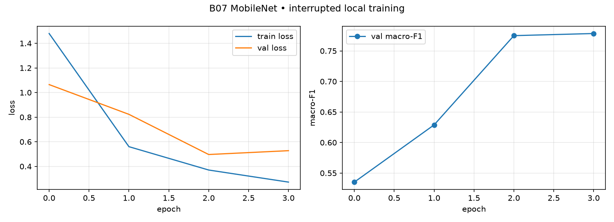

# DeepWeeds — kết quả thật của bản chạy rút gọn

MSSV: 2A202602926. Họ tên: Nguyễn Văn Chiến. Cập nhật ngày 05/10/2026.

## 1. Tóm tắt

Đã huấn luyện MobileNetV3 Large trên toàn bộ train fold 0, hoàn thành 4 epoch và dừng hàng đợi dài theo yêu cầu. Chọn checkpoint bằng macro-F1 val, so sánh single-view và hflip trên toàn bộ val, sau đó khớp temperature scaling trên val. Cấu hình Q01 dùng flip, seed 0, T=1.2052. Macro-F1 test=0.7770, top-1=0.8386, balanced accuracy=0.7745, ECE=0.0126. Đây là bài lab một phần, chưa đủ số thí nghiệm và seed theo rubric.

## 2. Dữ liệu và thiết lập

DeepWeeds có 17.509 ảnh, 9 lớp. Dùng nguyên bản fold 0: train 10.501, val 3.501, test 3.507. Kiểm tra local xác nhận giao các tập rỗng và mọi file ảnh tồn tại. Không thay đổi split, không gộp val vào train. Test chỉ dùng sau khi đã chọn cách suy luận trên val.

| Lớp | Train | Val | Test |
|---|---:|---:|---:|
| Chinee apple | 675 | 225 | 226 |
| Lantana | 637 | 213 | 213 |
| Parkinsonia | 618 | 206 | 207 |
| Parthenium | 613 | 204 | 205 |
| Prickly acacia | 637 | 212 | 213 |
| Rubber vine | 605 | 202 | 202 |
| Siam weed | 644 | 215 | 215 |
| Snake weed | 609 | 203 | 204 |
| Negative | 5463 | 1821 | 1822 |

Negative có 9.106 ảnh, khoảng 52%. Nhãn CSV có Chinee apple 1.126 và Lantana 1.063, khác bảng tham khảo trong README mỗi lớp một ảnh. Giữ nguyên CSV của tác giả.

Máy chạy CPU Intel64 Family 6 Model 154 Stepping 3, GenuineIntel, 4 thread, không CUDA. Python 3.11.9, torch 2.13.0+cpu, torchvision 0.29.1+cpu, timm 1.0.30, NumPy 1.26.4, pandas 1.5.3. MobileNetV3 dùng trọng số ImageNet của timm, finetune toàn bộ, 4.214 triệu tham số, khoảng 0.215 GMAC (đếm Conv2d/Linear, chưa gồm mọi phép toán).

Train: RandomResizedCrop224, hflip, chuẩn hóa ImageNet. Val/test: Resize256, CenterCrop224, chuẩn hóa ImageNet. CE, AdamW, LR backbone 1e-4, head 1e-3, weight decay 0.05, warmup 1 epoch, batch 16, AMP tắt. Hoàn thành 4 epoch trong lịch warmup+cosine 12 epoch. Không coi đây là cosine 4 epoch đã kết thúc. Chọn epoch có val macro-F1 cao nhất, hòa lấy sớm hơn.

38 test repo và forward 9 lớp đã đạt. Chưa có bằng chứng lưu cho kiểm tra overfit một batch và hình augmentation nên không ghi chúng đã hoàn thành.

## 3. Backbone và quá trình huấn luyện

Chỉ B07 MobileNet đã có kết quả thật. B01–B06 chưa chạy hoàn tất nên chưa thể xếp hạng các kiến trúc hoặc kết luận FLOPs dự báo độ trễ.

| Epoch (từ 1) | Train loss | Val loss | Val macro-F1 | Val top-1 |
|---:|---:|---:|---:|---:|
| 1 | 1.4796 | 1.0646 | 0.5352 | 0.6510 |
| 2 | 0.5601 | 0.8228 | 0.6289 | 0.7455 |
| 3 | 0.3704 | 0.4964 | 0.7750 | 0.8320 |
| 4 | 0.2722 | 0.5275 | 0.7784 | 0.8312 |

Macro-F1 val tăng từ 0.5352 lên 0.7784. Epoch 4 có F1 tốt hơn epoch 3 nhưng val loss tăng. Chưa đủ bằng chứng để kết luận về hội tụ hoặc quá khớp dài hạn.

## 4. Công thức huấn luyện

Đã chạy công thức nền ở B07. T00–T12 chưa được chạy như các thí nghiệm độc lập. Chưa có ablation khởi tạo, augmentation, loss, sampler, LR hay EMA. Chưa có delta so với T00 hoặc bằng chứng kết hợp các yếu tố.

## 5. Suy luận và độ trễ

| Phương pháp | Macro-F1 val | Top-1 val | ECE val | p50 ms | p95 ms | p99 ms |
|---|---:|---:|---:|---:|---:|---:|
| single | 0.7784 | 0.8312 | 0.0389 | 18.18 | 22.02 | 24.32 |
| flip | 0.7938 | 0.8455 | 0.0238 | 77.01 | 103.82 | 112.22 |
| flip + temperature | 0.7938 | 0.8455 | 0.0187 | 40.78 | 59.79 | 67.69 |

Hflip gộp logits, không gộp xác suất. T khớp riêng trên val. Độ trễ đo CPU fp32, batch 1, ảnh 224, 10 warmup và 50 lần đo, chỉ tính forward với input tổng hợp. Chưa gồm tải ảnh, tiền xử lý hoặc I/O. Hàng temperature đo forward của phương pháp đã chọn, chưa cộng chi phí softmax/calibration. Không coi đó là độ trễ toàn pipeline.

## 6. Kết quả test Q01 seed 0

Toàn bộ 3.507 ảnh. Các bản hiệu chuẩn và chưa hiệu chuẩn được tạo từ cùng một lượt logit test đã lưu.

| Chỉ số | Giá trị |
|---|---:|
| Macro-F1 val sau calibration | 0.7938 |
| Macro-F1 test | 0.7770 |
| Top-1 test | 0.8386 |
| Balanced accuracy test | 0.7745 |
| ECE test trước calibration | 0.0339 |
| ECE test sau calibration | 0.0126 |

Chỉ một seed nên chưa có mean ± std. `eval.py score` được chạy từ file dự đoán gốc. Chưa chạy `grade` vì không có nhóm chung kết/mốc >=3 seed tương ứng.

| Lớp | Số ảnh test | Precision | Recall | F1 |
|---|---:|---:|---:|---:|
| Chinee apple | 226 | 0.8675 | 0.5796 | 0.6950 |
| Lantana | 213 | 0.5025 | 0.9296 | 0.6524 |
| Parkinsonia | 207 | 0.8034 | 0.9082 | 0.8526 |
| Parthenium | 205 | 0.9293 | 0.8341 | 0.8792 |
| Prickly acacia | 213 | 0.8013 | 0.5681 | 0.6648 |
| Rubber vine | 202 | 0.7490 | 0.9307 | 0.8300 |
| Siam weed | 215 | 0.9181 | 0.7302 | 0.8135 |
| Snake weed | 204 | 0.8731 | 0.5735 | 0.6923 |
| Negative | 1822 | 0.9091 | 0.9166 | 0.9128 |

### Ma trận nhầm lẫn

Hàng là nhãn thật, cột là dự đoán, thứ tự lớp theo Label 0–8.

| Nhãn thật | Chinee apple | Lantana | Parkinsonia | Parthenium | Prickly acacia | Rubber vine | Siam weed | Snake weed | Negative |
|---|---:|---:|---:|---:|---:|---:|---:|---:|---:|
| Chinee apple | 131 | 20 | 1 | 2 | 4 | 10 | 0 | 15 | 43 |
| Lantana | 0 | 198 | 1 | 0 | 0 | 1 | 1 | 0 | 12 |
| Parkinsonia | 0 | 4 | 188 | 1 | 1 | 1 | 0 | 0 | 12 |
| Parthenium | 3 | 7 | 6 | 171 | 5 | 0 | 0 | 0 | 13 |
| Prickly acacia | 0 | 14 | 31 | 2 | 121 | 5 | 0 | 0 | 40 |
| Rubber vine | 0 | 3 | 1 | 1 | 0 | 188 | 1 | 0 | 8 |
| Siam weed | 0 | 38 | 0 | 0 | 0 | 3 | 157 | 1 | 16 |
| Snake weed | 10 | 46 | 0 | 0 | 3 | 4 | 1 | 117 | 23 |
| Negative | 7 | 64 | 6 | 7 | 17 | 39 | 11 | 1 | 1670 |

Chinee apple bị đoán thành Snake weed: 15 ảnh. Chiều ngược lại: 10 ảnh. Chưa có tập ảnh lỗi minh họa được xuất.

## 7. Kết luận

Q01 là cấu hình đã đánh giá trong phạm vi rút gọn. Chưa thể gọi là cấu hình tốt nhất của toàn bộ lab, chưa thể so sánh cải thiện với mốc nhiều seed hoặc đánh giá độ ổn định. Các số độ trễ chỉ dùng để mô tả CPU này, chưa đủ để khuyến nghị triển khai robot.

## 6b. Bổ sung R01 — ResNet50 train Colab T4 5 epoch (output Colab vừa tải về)

Huấn luyện bằng `DeepWeeds_Colab_T4.ipynb` trên GPU T4 (AMP, AdamW, LR backbone 1e-4 / head 1e-3, batch 32, 5 epoch). Checkpoint `best.pt` chọn bằng macro-F1 val. Suy luận single-view (I00), không temperature scaling.

| Chỉ số | Val | Test |
|---|---:|---:|
| Macro-F1 | 0.7607 | 0.7545 |
| Top-1 | 0.8280 | 0.8226 |
| Balanced acc | 0.7254 | 0.7142 |
| ECE | 0.0118 | 0.0163 |

Params 23.53M, GMAC 4.09 (224px). Độ trễ đo local CPU 4 thread batch1 fp32 forward: p50 245.1ms / p95 332.8ms / p99 358.8ms. Độ trễ T4 trên Colab chưa được lưu trong output nên không ghi số T4.

Per-class test R01 (từ `eval.py score`, đủ 3507 ảnh): Chinee apple F1 0.5316 (P 0.9333 / R 0.3717), Lantana 0.8089, Parkinsonia 0.8935, Parthenium 0.6646, Prickly acacia 0.7414, Rubber vine 0.7957, Siam weed 0.8020, Snake weed 0.6719, Negative 0.8808. Lớp khó nhất vẫn là Chinee apple và Parthenium/Snake weed (recall thấp), Negative vẫn cao nhất.

So với Q01 MobileNet (test macro 0.7770): R01 ResNet50 5 epoch thấp hơn 0.0225. Chưa kết luận do khác backbone, khác epoch (4 vs 5), khác seed/môi trường và đều mới 1 seed (không có std).

## 8. Hạn chế và phần chưa hoàn thành

- Một backbone, một seed, dừng sau 4 epoch.
- Bổ sung 05/10/2026: thêm R01 ResNet50 Colab T4 5 epoch 1 seed (val 0.7607 / test 0.7545). Vẫn chưa đủ >=5 backbone, >=3 trục ablation, >=4 phương pháp suy luận và >=3 seed cho chung kết/mốc.
- Chưa đủ >=5 backbone, >=3 trục ablation, >=4 phương pháp suy luận và >=3 seed cho chung kết/mốc.
- Chưa có kiểm tra overfit một batch, scatter F1–latency, ảnh lỗi và benchmark toàn pipeline.
- Fold 0 chia ngẫu nhiên theo ảnh, không theo địa điểm nên test có thể lạc quan. Chưa đo lệch miền mùa/ánh sáng/địa điểm.

## Bằng chứng tái lập

`evidence/results_actual.json`, `evidence/B07_seed0_history.csv`, `evidence/eval_Q01/`, `predictions/Q01_seed0_val.csv`, `predictions/Q01_seed0_test.csv`, `predictions/Q01uncal_seed0_test.csv`. Bổ sung R01: `predictions/R01_seed0_val.csv`, `predictions/R01_seed0_test.csv`, `evidence/eval_R01/`, `evidence/val_R01.json`, `evidence/lat_R01_cpu.json`, `evidence/predictions_R01_colab_original.csv`. Code gốc `eval.py` không sửa. `results.xlsx` chứa số đã đo và ghi rõ các dòng chưa chạy.
